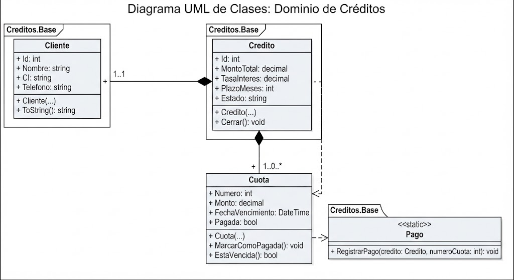

# H3 · Singleton — por qué NO se aplica aquí

## El caso, revisado

Las clases del diagrama del H2 son: `Cliente`, `Credito`, `Cuota` y el servicio `Pago`.
Ninguna de ellas necesita, ni debería, existir en una única instancia global durante la
vida del programa:

- **Cliente**: por definición hay *muchos* clientes. Forzar una sola instancia rompería
  el dominio, no lo mejoraría.
- **Credito**: cada cliente puede tener varios créditos, y cada crédito es un objeto de
  datos distinto (montos, cuotas, fechas propias). Un Singleton aquí significaría que
  todo el sistema comparte "el" crédito, lo cual no tiene sentido de negocio.
- **Cuota**: lo mismo — son entidades con identidad propia dentro de un crédito.
- **Pago**: ya es un servicio *sin estado* (`static`), no guarda datos entre llamadas.
  Convertirlo en Singleton no le agregaría nada: no hay estado que proteger de
  instancias duplicadas.

## Dónde SÍ suele justificarse un Singleton (y por qué no aparece en este diagrama)

Los casos típicos donde Singleton tiene sentido son cosas como una configuración global
de la aplicación, un logger compartido, o un pool de conexiones — es decir,
**infraestructura transversal**, no entidades del dominio de negocio. El diagrama del H2
modela el dominio de Créditos (clientes, créditos, cuotas, pagos), no infraestructura.
Ninguna de esas piezas transversales aparece ahí, así que no hay nada legítimo que
"singletonizar" sin inventar una clase que el diagrama no pide.

## Conclusión

Meter un Singleton a la fuerza en `Cliente`, `Credito` o `Cuota` sería el antipatrón
clásico: "tengo el patrón, busco dónde meterlo" — exactamente al revés de cómo se debe
diseñar. Por eso esta carpeta no tiene una copia de `base/` con Singleton aplicado: el
caso, tal como está modelado, no lo pide.
